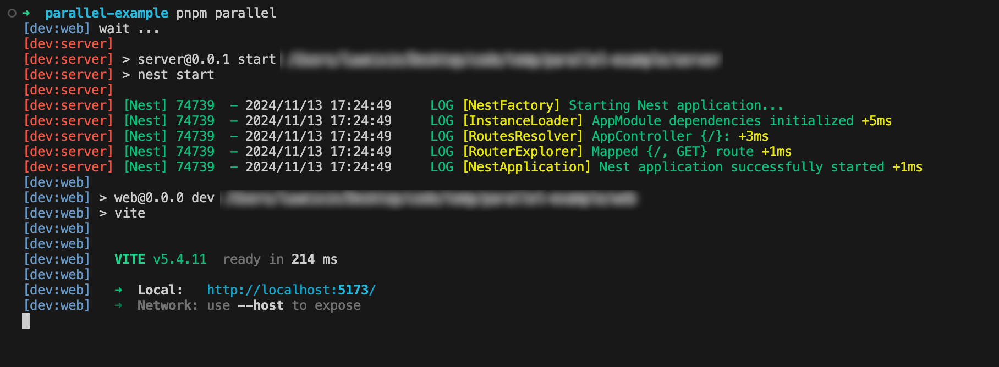

# parallel-wait-run

支持同时运行多个`npm scripts`，并且可以通过自定义的异步函数控制每一个`npm scripts`的启动时机。



# 文档

## 快速开始

1. 在项目根目录添加配置文件 `parallel.config.ts`（也支持其他`JS`和`TS`扩展名）

```ts
import { defineConfig } from "parallel-wait-run";

export default defineConfig({
  scripts: [
    {
      name: "dev",
      command: `dev command`,
      wait: async () => {
        sleep(1000);
        return true;
      },
    },
    {
      name: `unit-test`,
      command: `unit-test command`,
      wait: async () => {
        sleep(2000);
        return true;
      },
    },
  ],
});
```

也支持使用函数生成配置

```ts
import { defineConfig } from "parallel-wait-run";

export default defineConfig(({ mode, root }) => {
  return {
    scripts: [
      {
        name: "dev",
        command: `pnpm  dev`,
      },
      {
        name: `unit-test`,
        command: `pnpm test-watch`,
      },
    ],
  };
});
```

异步函数也是支持的

```ts
import { defineConfig } from "parallel-wait-run";

export default defineConfig(async ({ mode, root }) => {
  return {
    scripts: [
      {
        name: "dev",
        command: `pnpm  dev`,
      },
      {
        name: `unit-test`,
        command: `pnpm test-watch`,
      },
    ],
  };
});
```

2. 运行

``` bash
npm run parallel
```

使用`pnpm`

``` bash
pnpm parallel
```

使用`yarn`

``` bash
yarn parallel
```

## 命令行选项

### -r, --root  

命令运行的根路径，默认`process.cwd()`, 必须为绝对路径

示例: 

```bash
npm run parallel -r /a/b/c
```

### -c, --config 

指定配置文件，默认会在根路径下自动匹配`parallel.config.[ts,js,cjs,mjs]`, 如果设置为相对路径，则会以 `root`为基础路径计算路径

示例: 

```bash
npm run parallel -c ./parallel.custom-config.ts
```
### -m, --mode

指定模式，一般在使用函数生成配置时使用，如

```ts
export default defineConfig(({ mode }) => {
  if (mode === "dev") {
    return {
      scripts: [],
    };
  } else {
    return {
      scripts: [],
    };
  }
});
```

### -g, --group

指定运行某一组脚本

### -h, --help

显示帮助信息

### -v, --version

显示版本号 

## 配置选项

### root

- 类型: `string`
- 是否必填: 否
- 默认值: `process.cwd()` 
- 根路径，如果使用命令行指定了`root`，则此配置会被覆盖

### beforeRun

- 类型: `() => MaybePromise<boolean>`
- 是否必填: 否
- 在运行所有脚本命令前运行的函数，如果返回`false`, 则会退出运行

### scripts

- 类型: `array`
- 是否必填: 是
- 默认运行的脚本列表

`script`的参数如下:

#### script.name 

- 类型: `string`
- 是否必填: 是
- 脚本名称

#### script.command 

- 类型: `string`
- 是否必填: 是
- 脚本的具体命令，例如`npm run dev`


#### script.wait 

- 类型: `() => MaybePromise<boolean>`
- 是否必填: 否
- 当此函数执行完成后，运行脚本中的命令，如果返回`false`,则会退出整个进程的运行

#### script.cwd 

- 类型: `string`
- 是否必填: 否
- 执行脚本命令的`cwd`,如果未指定，则会使用`root`的值

#### script.env 

- 类型: `object`
- 是否必填: 否
- 为当前脚本命令注入一些环境参数，类型为

```ts
type Env = {
  [name: string]: string;
}
```

#### script.prefix.text 

- 类型: `string`
- 是否必填: 否
- 脚本命令日志输出的前缀，如果没有指定，则会使用`script.name`

#### script.prefix.color 

- 类型: `string`
- 是否必填: 否
- 脚本命令日志前缀的颜色，如果没有指定，则会随机指定生成一种颜色，支持的颜色格式`#FF8800`,会使用[`chalk.hex`](https://www.npmjs.com/package/chalk)来进行添加颜色

### groups

- 类型: `object`
- 是否必填: 否
- 定义多组脚本，类型为

```ts
type Group = {
  [name: string]: ParallelScripts;
}
```

`ParallelScripts`的相关参数参照上面的`scripts`选项

## 致谢

- 代码中的部分实现参考了[`concurrently`](https://www.npmjs.com/package/concurrently)，感谢[`concurrently`](https://www.npmjs.com/package/concurrently)